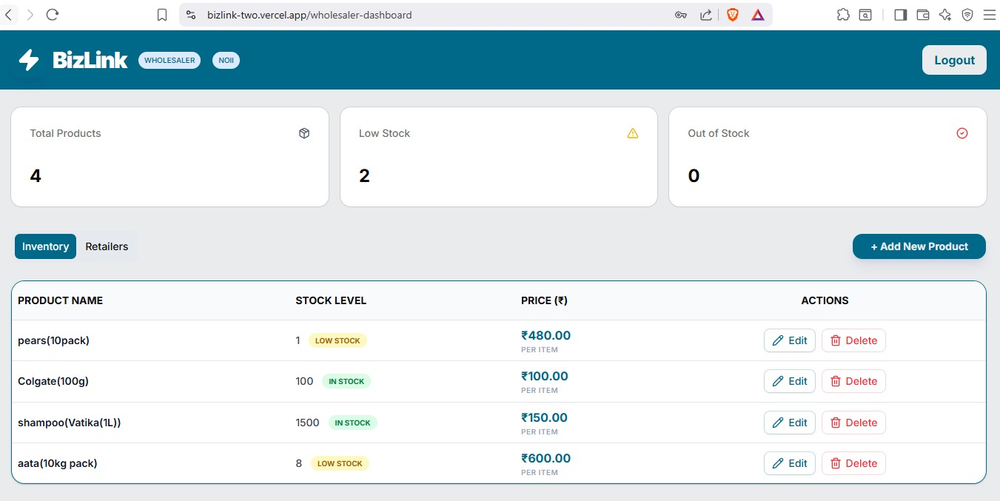
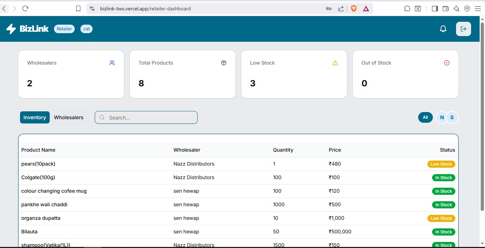
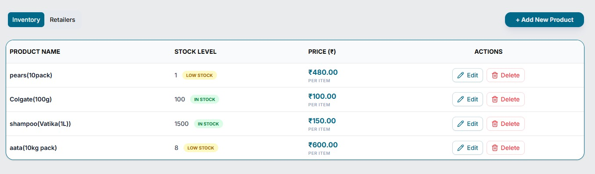
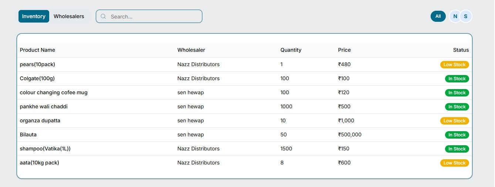
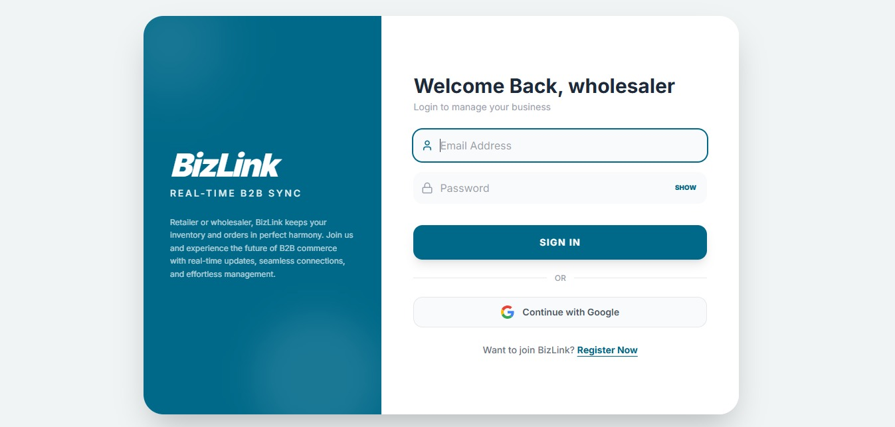
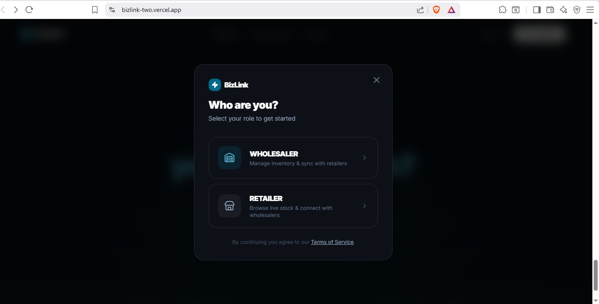

<div align="center">

# 🔗 BizLink

### B2B Business Networking & Inventory Platform

**A multi-tenant SaaS platform connecting wholesalers and retailers — with real-time inventory sync, row-level data isolation, and zero cross-tenant exposure.**

[](https://bizlink-two.vercel.app/)
[](https://nextjs.org/)
[](https://supabase.com/)
[](https://tailwindcss.com/)
[](https://ui.shadcn.com/)
[](https://vercel.com/)

</div>

---
## 🎬 Demo


## 📸 Screenshots

| Wholesaler Dashboard                                            | Retailer Dashboard                                          |
| --------------------------------------------------------------- | ----------------------------------------------------------- |
|  |  |

| Wholesaler Inventory                                            | Retailer Inventory                                          |
| --------------------------------------------------------------- | ----------------------------------------------------------- |
|  |  |

| Login                             | Select Role                                   |
| --------------------------------- | --------------------------------------------- |
|  |  |

---

## 🎯 What is BizLink?

BizLink is a **multi-tenant B2B inventory and networking platform** built for the supply chain — where wholesalers and retailers manage their stock, track transactions, and operate in fully isolated environments.

No shared data. No polling delays. No backend team needed — built entirely by one developer, end-to-end.

> **The Problem:** Wholesalers and retailers juggle spreadsheets, WhatsApp messages, and manual reconciliation to track inventory. BizLink eliminates all of that with real-time sync and role-based access — out of the box.

---

## ✨ Key Features

### 🏢 Multi-Tenant Architecture

- Each wholesaler and retailer account operates in a **fully isolated environment**
- Zero cross-tenant data exposure at the **database layer** using Supabase Row Level Security (RLS)
- Every SQL query is scoped to the authenticated user — no application-level filtering hacks

### ⚡ Real-Time Inventory Sync

- Powered by **Supabase Realtime subscriptions** (PostgreSQL LISTEN/NOTIFY)
- Stock changes propagate **instantly** across all connected clients
- No polling, no page refresh, no delay — changes appear live

### 🔐 Authentication & Authorization

- Secure **email/password auth** via Supabase Auth
- Session management with protected routes in Next.js
- Role-aware UI — wholesalers and retailers see different views

### 📊 Inventory Management

- Full **CRUD operations** for products and stock
- Real-time stock level tracking
- Clean dashboard with at-a-glance metrics

### 🎨 Modern, Responsive UI

- Built with **Shadcn UI** components on top of **Tailwind CSS**
- Fully responsive across desktop, tablet, and mobile
- Clean, professional design system

---

## 🛠️ Tech Stack

| Layer          | Technology              | Purpose                                     |
| -------------- | ----------------------- | ------------------------------------------- |
| **Framework**  | Next.js 15 (App Router) | Full-stack React framework, SSR, API routes |
| **Database**   | Supabase (PostgreSQL)   | Relational DB with RLS policies             |
| **Auth**       | Supabase Auth           | Email/password authentication               |
| **Realtime**   | Supabase Realtime       | Live inventory subscriptions                |
| **Styling**    | Tailwind CSS            | Utility-first CSS                           |
| **Components** | Shadcn UI               | Accessible, composable UI components        |
| **Deployment** | Vercel                  | CI/CD and hosting                           |

---

## 🏗️ Architecture Highlights

```
BizLink
├── Next.js App Router (Frontend + API Routes)
│   ├── /app/(auth)         → Login, Signup pages
│   ├── /app/dashboard      → Role-based dashboard
│   ├── /app/inventory      → Real-time inventory views
│   └── /app/api            → Server-side API handlers
│
├── Supabase (Backend)
│   ├── PostgreSQL           → Primary database
│   ├── Row Level Security   → Multi-tenant data isolation
│   ├── Realtime             → WebSocket subscriptions
│   └── Auth                 → Session & JWT management
│
└── Vercel
    └── Production deployment with automatic preview branches
```

### 🔒 Multi-Tenancy via RLS (Key Technical Decision)

Instead of filtering data at the application level (which is error-prone), BizLink enforces isolation at the **database level** using Supabase Row Level Security policies:

```sql
-- Example RLS policy
CREATE POLICY "Users can only access their own data"
ON inventory
FOR ALL
USING (auth.uid() = user_id);
```

Every query is automatically scoped. Even if application code had a bug, the database would still reject unauthorized reads.

---

## 🚀 Getting Started

### Prerequisites

- Node.js 18+
- A Supabase project ([create one free](https://supabase.com))

### 1. Clone the repository

```bash
git clone https://github.com/priyanshu101120/Bizlink.git
cd Bizlink
```

### 2. Install dependencies

```bash
npm install
```

### 3. Set up environment variables

```bash
cp .env.example .env.local
```

Fill in your `.env.local`:

```env
NEXT_PUBLIC_SUPABASE_URL=your_supabase_project_url
NEXT_PUBLIC_SUPABASE_ANON_KEY=your_supabase_anon_key
```

### 4. Run the development server

```bash
npm run dev
```

Open [http://localhost:3000](http://localhost:3000) to view the app.

---

## 📁 Project Structure

```
bizlink/
├── app/                    # Next.js App Router
│   ├── (auth)/             # Auth pages (login, signup)
│   ├── dashboard/          # Protected dashboard
│   ├── inventory/          # Inventory management
│   └── layout.tsx          # Root layout
├── components/             # Reusable UI components
│   ├── ui/                 # Shadcn UI components
│   └── ...
├── lib/                    # Utilities & Supabase client
├── types/                  # TypeScript type definitions
└── public/                 # Static assets
```

---

## 🧠 What I Learned

Building BizLink as a **solo developer** end-to-end taught me:

- **Multi-tenancy patterns** — enforcing data isolation at the DB layer vs. the application layer, and why the DB layer is safer
- **Supabase Realtime** — setting up WebSocket subscriptions that survive reconnects and scale without polling
- **RLS policy design** — writing policies that are secure by default, not secure "when the code works correctly"
- **Next.js App Router** — server components, server actions, and mixing SSR with client-side interactivity
- **Full-stack ownership** — schema design, auth flows, frontend UX, and production deployment — all as one person

---

## 🔮 Roadmap

- [ ] Add messaging between wholesalers and retailers
- [ ] Invoice and order history
- [ ] Analytics dashboard with charts (TanStack Query + Recharts)
- [ ] Email notifications for low stock alerts
- [ ] Mobile app (React Native / Expo)

---

## 👤 Author

**Priyanshu Singh** — Built this end-to-end as a solo developer.

[](https://github.com/priyanshu101120)
[](https://www.linkedin.com/in/priyanshu-singh-452459360/)

---

## 📄 License

This project is open source and available under the [MIT License](LICENSE).

---

<div align="center">

**⭐ If you found this project interesting, please give it a star!**

_Built with ❤️ using Next.js, Supabase, and Shadcn UI_

</div>
